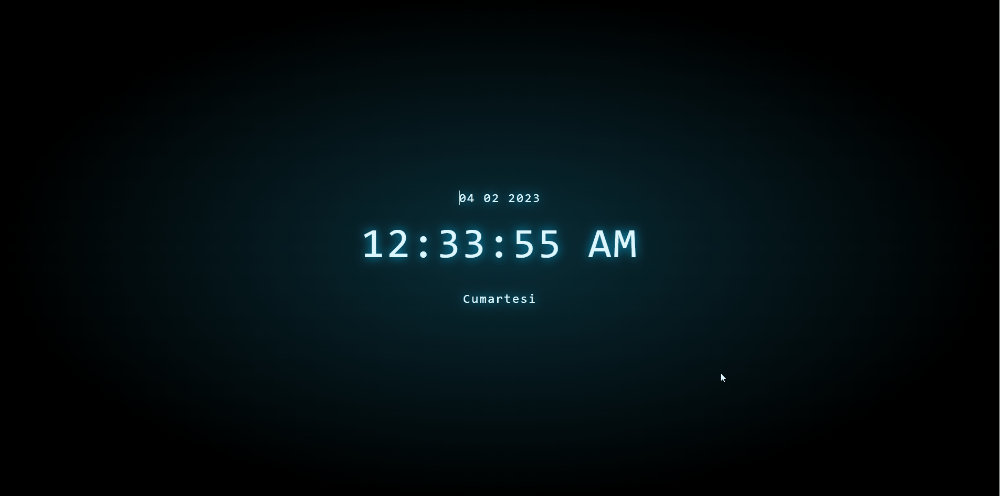

# DIGITAL CLOCK {HTML + CSS + JS}



## Description
With this project, it aims to make a digital clock application on the screen and to support it with sound effects.

## Project Skeleton 

```
WEATHER_APP(folder)
|
|----README.md
|----img(folder)
    |----mp3 and gifs
|----index.html
|----style.css
|----script.js
```

## What I used in this project?

- ## HTML
- ## JS
  - ### DOM
  - ### SETINTERVAL
  - ### AUDIO
- ## CSS
  - ### POSITION
  - ### TRANSFORM
  - ### SHADOW

<left> ⌛ Happy Coding  💻🎶🍕🍀✍ </left>


